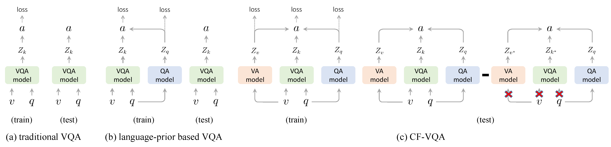

# Counterfactual VQA (CF-VQA)

This repository is the Pytorch implementation of our paper ["Counterfactual VQA: A Cause-Effect Look at Language Bias"](https://arxiv.org/abs/2006.04315) in CVPR 2021. This code is implemented as a fork of [RUBi][1].

CF-VQA is proposed to capture and mitigate language bias in VQA from the view of causality. CF-VQA (1) captures the language bias as the direct causal effect of questions on answers, and (2) reduces the language bias by subtracting the direct language effect from the total causal effect.

<p align="center">
    
</p>


If you find this paper helps your research, please kindly consider citing our paper in your publications.
```
@inproceedings{niu2020counterfactual,
  title={Counterfactual VQA: A Cause-Effect Look at Language Bias},
  author={Niu, Yulei and Tang, Kaihua and Zhang, Hanwang and Lu, Zhiwu and Hua, Xian-Sheng and Wen, Ji-Rong},
  booktitle={Proceedings of the IEEE/CVF Conference on Computer Vision and Pattern Recognition},
  year={2021}
}
```
## Summary

* [Installation](#installation)
    * [Setup and dependencies](#1-setup-and-dependencies)
    * [Download datasets](#2-download-datasets)
* [Quick start](#quick-start)
    * [Train a model](#train-a-model)
    * [Evaluate a model](#evaluate-a-model)
* [Useful commands](#useful-commands)
* [Acknowledgment](#acknowledgment)

## Installation


### 1. Setup and dependencies

Install Anaconda or Miniconda distribution based on Python3+ from their downloads' site.

```bash
conda create --name cfvqa python=3.7
source activate cfvqa
pip install -r requirements.txt
```

### 2. Download datasets

Download annotations, images and features for VQA experiments:
```bash
bash cfvqa/datasets/scripts/download_vqa2.sh
bash cfvqa/datasets/scripts/download_vqacp2.sh
```


## Quick start


### Train a model

The [boostrap/run.py](https://github.com/Cadene/bootstrap.pytorch/blob/master/bootstrap/run.py) file load the options contained in a yaml file, create the corresponding experiment directory and start the training procedure. For instance, you can train our best model on VQA-CP v2 (CFVQA+SUM+SMRL) by running:
```bash?
python -m bootstrap.run -o cfvqa/options/vqacp2/smrl_cfvqa_sum.yaml
```
Then, several files are going to be created in `logs/vqacp2/smrl_cfvqa_sum/`:
- [options.yaml] (copy of options)
- [logs.txt] (history of print)
- [logs.json] (batchs and epochs statistics)
- **[\_vq\_val\_oe.json] (statistics for the language-prior based strategy, e.g., RUBi)**
- **[\_cfvqa\_val\_oe.json] (statistics for CF-VQA)**
- [\_q\_val\_oe.json] (statistics for language-only branch)
- [\_v\_val\_oe.json] (statistics for vision-only branch)
- [\_all\_val\_oe.json] (statistics for the ensembled branch)
- ckpt_last_engine.pth.tar (checkpoints of last epoch)
- ckpt_last_model.pth.tar
- ckpt_last_optimizer.pth.tar

Many options are available in the options directory. CFVQA represents the complete causal graph while cfvqas represents the simplified causal graph.

### Evaluate a model

There is no test set on VQA-CP v2, our main dataset. The evaluation is done on the validation set. For a model trained on VQA v2, you can evaluate your model on the test set. In this example, [boostrap/run.py](https://github.com/Cadene/bootstrap.pytorch/blob/master/bootstrap/run.py) load the options from your experiment directory, resume the best checkpoint on the validation set and start an evaluation on the testing set instead of the validation set while skipping the training set (train_split is empty). Thanks to `--misc.logs_name`, the logs will be written in the new `logs_predicate.txt` and `logs_predicate.json` files, instead of being appended to the `logs.txt` and `logs.json` files.
```bash
python -m bootstrap.run \
-o ./logs/vqacp2/smrl_cfvqa_sum/options.yaml \
--exp.resume last \
--dataset.train_split ''\
--dataset.eval_split val \
--misc.logs_name test 
```

## Useful commands


### Use a specific GPU

For a specific experiment:
```bash
CUDA_VISIBLE_DEVICES=0 python -m boostrap.run -o cfvqa/options/vqacp2/smrl_cfvqa_sum.yaml
```

For the current terminal session:
```bash
export CUDA_VISIBLE_DEVICES=0
```

### Overwrite an option

The boostrap.pytorch framework makes it easy to overwrite a hyperparameter. In this example, we run an experiment with a non-default learning rate. Thus, I also overwrite the experiment directory path:
```bash
python -m bootstrap.run -o cfvqa/options/vqacp2/smrl_cfvqa_sum.yaml \
--optimizer.lr 0.0003 \
--exp.dir logs/vqacp2/smrl_cfvqa_sum_lr,0.0003
```

### Resume training

If a problem occurs, it is easy to resume the last epoch by specifying the options file from the experiment directory while overwritting the `exp.resume` option (default is None):
```bash
python -m bootstrap.run -o logs/vqacp2/smrl_cfvqa_sum/options.yaml \
--exp.resume last
```


## Acknowledgment

Special thanks to the authors of [RUBi][1], [BLOCK][2], and [bootstrap.pytorch][3], and the datasets used in this research project.


[1]: https://github.com/cdancette/rubi.bootstrap.pytorch
[2]: https://github.com/Cadene/block.bootstrap.pytorch
[3]: https://github.com/Cadene/bootstrap.pytorch